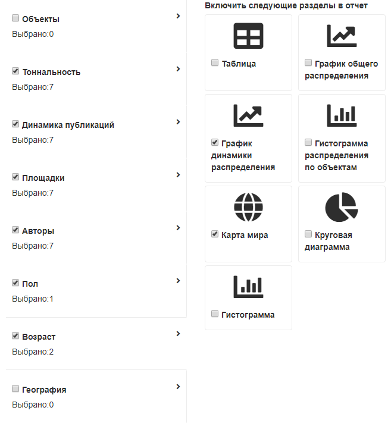

# Плагин "Выбор разделов"

### Описание
Плагин представляет собой функцию и предполагает наличие **jQuery**
```
SectionSelection.init(placeholder: string, model: Section[], callback: Function)
```
где  
**placeholder** - селектор DOM элемента, в который нужно вставить html SectionSelection    
**model** - данные на основе, которых строится интерфейс  
**Section** - левый столбик  
**SectionItem** - правый с иконками  
**callback** - функция которая будет выполнена, после каждого изменения состояния (чекбоксов)
 в левом или правом столбике. Предпологается что в ней будет написан код сохранения model-и на сервере
   
```
export interface Section {
    id: string;           - уникальный, не должен совпадать с id SectionItem
    name: string;         - название Раздела
    active: boolean;      - состояние выбранности Раздела
    checked: boolean;     - состояние галки "выбрать все"
    count: number;        - кол-во выбранных item-ов под галкой "Выбрано: х" 
    items: SectionItem[]; - список item-ов
}

export interface SectionItem {
    id: string;           - уникальный, не должен совпадать с id Section
    name: string;         - название Подраздела
    icon: string;         - иконка из awesome-овских
    checked: boolean;     - состояние галки под иконкой
}
```

### Разработка

Структура папок

**debug** - результат webpack сборки дебаг версии index.js + styles.css (с sourcemap-ами)  
**public** - библиотеки и свои скрипты, стили не входяшие с сборку плагина SectionSelection  
**release** -  результат webpack сборки релиз версии index.js + styles.css (минифицированные)  
**src** - исходный код плагина, все собирается webpack-ом  
**webfonts** - awesome шрифты v5  

Скрипты в `package.json`  

**build** - однократная сборка  
**start** - запуск в `watch` режиме   
**patch & publish** - собрать и положить в `npm` и `git`    

### Использование 
Собрать 
```
$ npm install
$ npm run build
```  
Подключить скрипт и стили
```html
<link rel="stylesheet" href="node_modules/section-selection/release/styles.css">
<script src="node_modules/section-selection/release/index.js"></script>
```

Вызвать `SectionSelection.init()`
```javascript
$(function () {
    SectionSelection.init('.js-placeholder', window.testData, function (testData) {
        console.log(testData);
    })
});
```

###Результат
В результате должно получиться примерно так:

